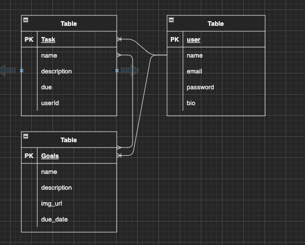
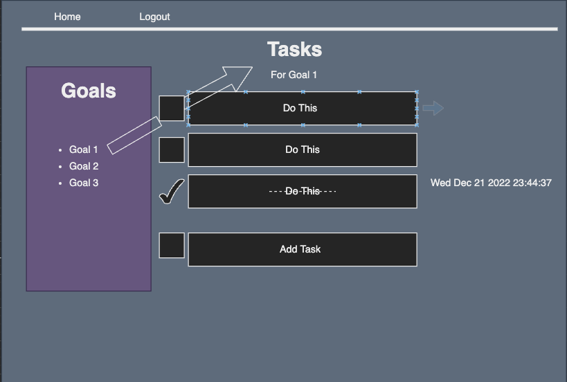

# Project-Two

# Description
* Create an organizer for all your to-dos. Set due dates and login to your profile to update progress. 

# Project Link:
https://ga-crystal-projectmanagement.herokuapp.com/

## Installation Instructions
* Fork and clone this repository to your local directory
* Navigate to the directory in your terminal and run ` npm i ` to install dependencies
* Run `touch .env `and type in the following code in the .env file:
``` ENV_SECRET='secret' ```
* Replace 'secret' with yor choice of string to hash your userIds
* Go to https://unsplash.com/ to sign up for an account and get your API Key. 
* Paste your API Key in the .env file. 
* Setup your database (this app has four existing models: user, project, goal, task)
  * Run `createdb auth_boilerplate` to create the database
  * Run `sequelize db:migrate` to run migrations
* Use `nodemon` to start your application
* Go to http://localhost:8010/ in any browser to track your personal projects

## API
* Unsplash.com

## ERD


## Wireframe


## User stories
* As a user, I want to sign in to my account. 
* I want to sign out of my account.
* I want to view my profile which has a list of all of my goals and to-dos.
* I want to edit and delete my goals and to-dos.
* I want to customize my goals and to dos with photos. 


## USER
| HTTP METHOD (_Verb_) | URL (_Nouns_)     | CRUD    | Response                             | Notes                                                                                                                    |
| -------------------- | ----------------- | ------- | ------------------------------------ | ------------------------------------------------------------------------------------------------------------------------ |
| GET                  | `/`          | READ    | Welcome page with information about other projects if logged in |                                                                                       |
| POST                  | `/users/new` | CREATE   | Sign up for account form              | requires email and password                                             |
| GET                | `/users/login`          | READ |  Page requires email and password authetication from database      | redirect to where to find data (GET `/users/:user_id`) or just the new user data |
| DELETE               | `/users/:userid` | DESTROY | No data                              | can send  redirect to homepage (GET `/`)                               |


## GOALS
| HTTP METHOD (_Verb_) | URL (_Nouns_)     | CRUD    | Response                             | Notes                                                                                                                    |
| -------------------- | ----------------- | ------- | ------------------------------------ | ------------------------------------------------------------------------------------------------------------------------ |
| GET             | `/goals` | READ | Page displaying all goals for user     |                               |
| GET              | `/goals/:goalId` | READ| Page associated with one specific goal  |  
| GET              | `/goals/new` | READ| Page with form to create a goal  | 
| GET              | `/goals/edit` | READ| Page with form to update goal  | 
| GET              | `/goals/:goalId/photo` | READ| Page with form to update photo header | 
| POST           | `/goals` | CREATE| Add a new goal |    redirect to `goals/:goalsid` 
| POST           | `/goals/:goalId/photo` | CREATE| Add a new goal header photo |    redirect to `goals/:goalsid`      
| PUT        | `/goals/:goalId` | Update| update a goal with progress, due dates, etc |    redirect to `/goals/:goalId` and show updated information
| DELETE       | `/goals/:goalId` | DESTROY | no data |    redirect to `/goals' and show updated information

## PROJECTS
| HTTP METHOD (_Verb_) | URL (_Nouns_)     | CRUD    | Response                             | Notes                                                                                                                    |
| -------------------- | ----------------- | ------- | ------------------------------------ | ------------------------------------------------------------------------------------------------------------------------ |
| GET             | `/projects` | READ | Page displaying all project information for user     |   
| GET             | `projects/new` | READ | Page displaying form to create a new project     |  
| GET             | `projects/:projectId` | READ | Page displaying a single project's information  |  
| GET             | `projects/:projectId/photo` | READ | Page displaying form to add a photo to the project's header   |  
| POST            | `/projects` | CREATE| Create a new project     |  
| POST            | `/projects/:projectId/photo` | CREATE| Choose a photo header for the project    |  
## TASKS
| HTTP METHOD (_Verb_) | URL (_Nouns_)     | CRUD    | Response                             | Notes                                                                                                                    |
| -------------------- | ----------------- | ------- | ------------------------------------ | ------------------------------------------------------------------------------------------------------------------------ |
| POST            | `/tasks` | CREATE| Create a new task    |  
| PUT           | `/tasks` | UPDATE| Update a task's progress    |  
| DELETE          | `/tasks` | DESTROY| DELETE a task  |  

# MVP
* Create two new models that store data about goals and tasks using postgres
* Insert Unsplash API to give users pictures to insert into project projects and goals
* Create full CRUD routes on goals using express
* Add in bootstrap styling

* Goals for this project are to:
    - [x]  Affirm learning of Sequelize and PostgresQL
    - [x]  Affirm learning of Express and Node.js
    - [x]  Learn how to use Bootstrap framework
    - [x]  Implement an API with a local database
    - [x]  Learn about user login creation and security
    - [x]  Learn about encrypting login information
    - [x]  Learn about retrieving encrypted information

# Stretch
* Create a reminder system when dates are approaching. 
* Create full CRUD routes on tasks using express
* Add a blogging component and make this into an event/travel planning blog
* Have a pre-defined travel organizer available
* Have a pre-defined event organizer available
* Add in another model for blogging
* Add a photo uploading API 
* Add commenting abilities
* Create a better profile experience with photo uploading and public information. 
* Create a progress bar that updates as tasks are completed

